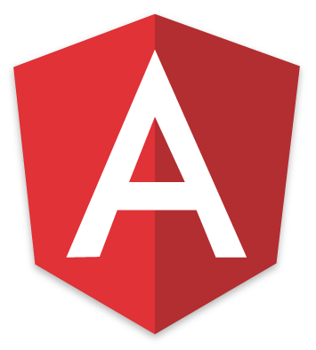

# SciQuest Supplier PoC
A proof-of-concept Angular app that utilizes Sprint Boot to demonstrate managing Suppliers

## Tech stack
### User Interface

 Angular

 Bootstrap

### REST API

 Spring Boot

 Hibernate

- Java 8
- MySQL
- Swagger
- Nginx

### Amazon Web Services
- Elastic Beanstalk
- Relational Database Service

### Tools
- Maven
- Bower
- Git

## Required software
 - Node
 - npm
 - git
 - bower
 - Maven
 - Java 8

## Running the app locally
 - bower install
 - mvn spring-boot:run
 
## Building a runnable JAR
 - mvn clean package
 - java -jar target/sq-supplier-poc-0.1.0.jar
